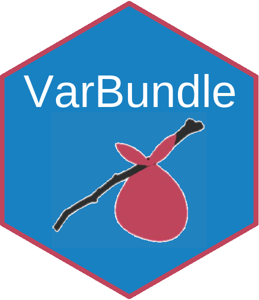

<!-- README.md is generated from README.Rmd. Please edit that file -->
VarBundle
=========



VarBundle supports defensive programming by making it easy for R developers to bundle conceptually related read-only variables in a named, list-like object of immutable constants.

Installation
------------

``` r
# Install the released version from CRAN:
install.packages("VarBundle")

# Install the development version from GitHub:
# install.packages("devtools")
devtools::install_github("loudermilk/VarBundle")
```

Usage
-----

##### VarBundle fields can be accessed like lists.

``` r
library(VarBundle)
thresholds <- varbundle(list(min = 1, max = 100))

# Read-only Access
thresholds$max #100
#> [1] 100
thresholds[["min"]] #1
#> [1] 1
```

##### But fields are read-only and new fields cannot be added after object creation.

``` r
# Assignment throws error
thresholds$min <- 25 # VarBundle fields are read only.

# Cannot create new fields after object creation
thesholds$foo <- 10 # Cannot add new fields to VarBundle
```

##### The quickest way to learn about {VarBundle} is to read the vignette.

``` r
browseVignettes(package = "VarBundle")
#> No vignettes found by browseVignettes(package = "VarBundle")
```

Getting Help
------------

If you have a question, encounter a bug (or typo), or have a feature request, please submit an issue on GitHub.
